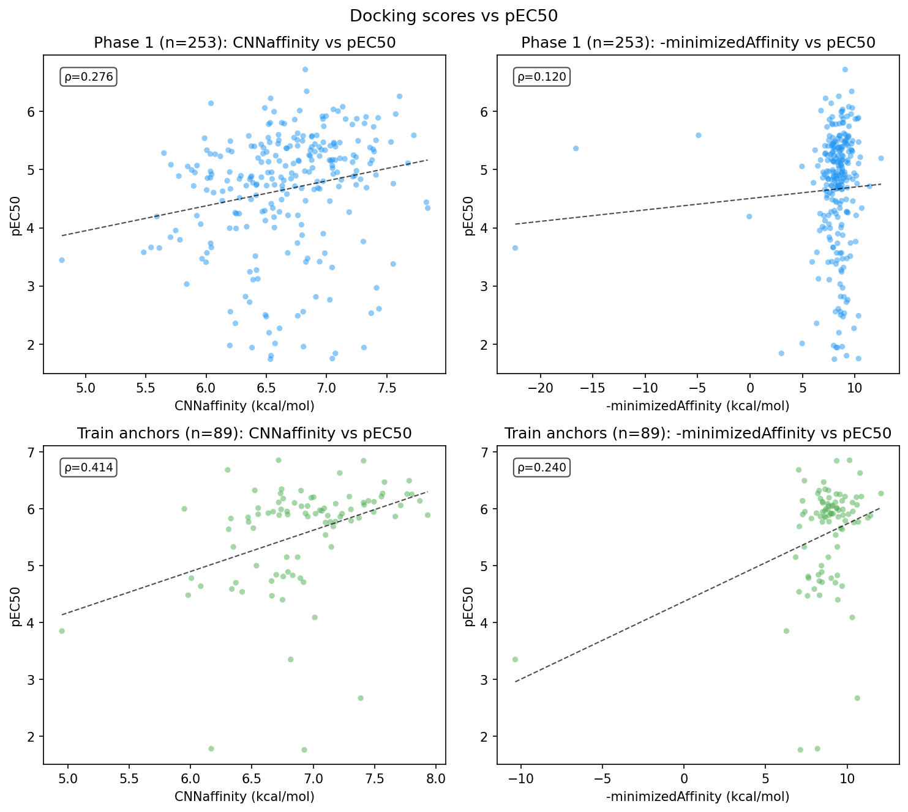
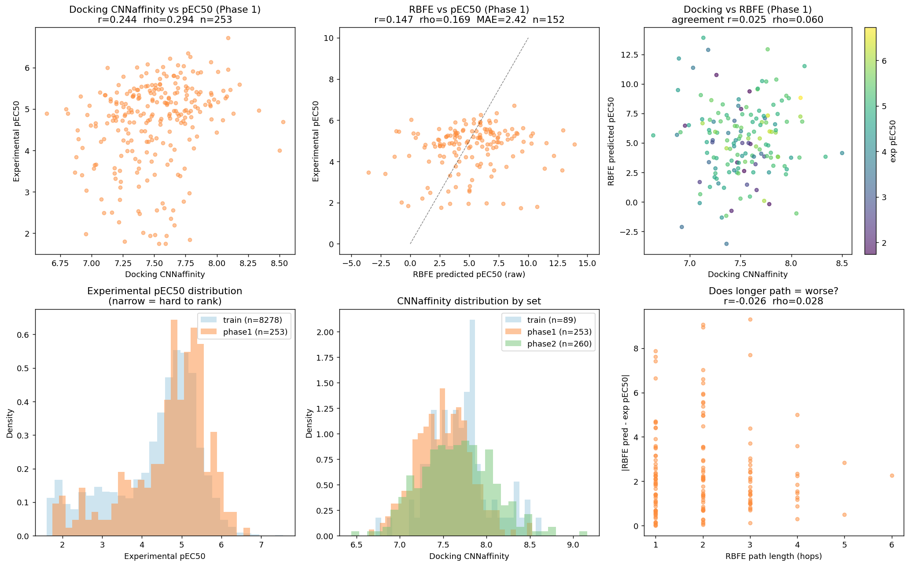
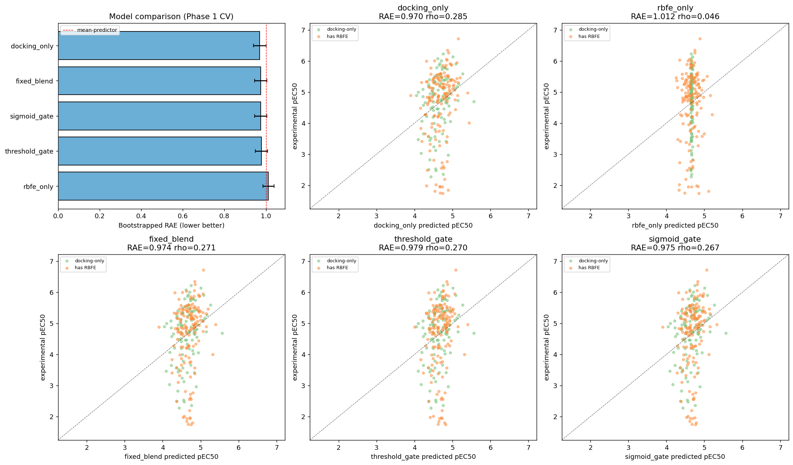
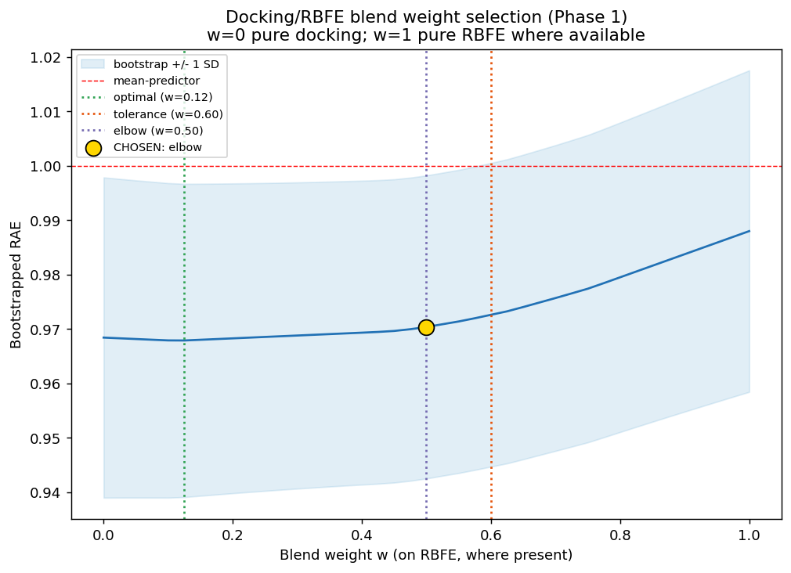
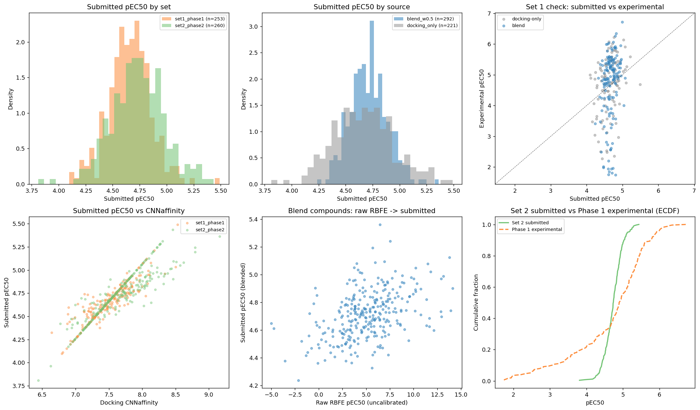
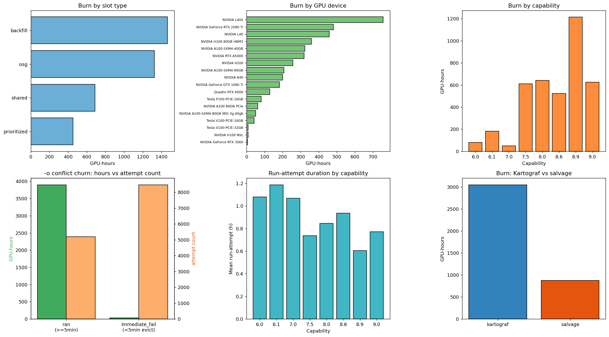
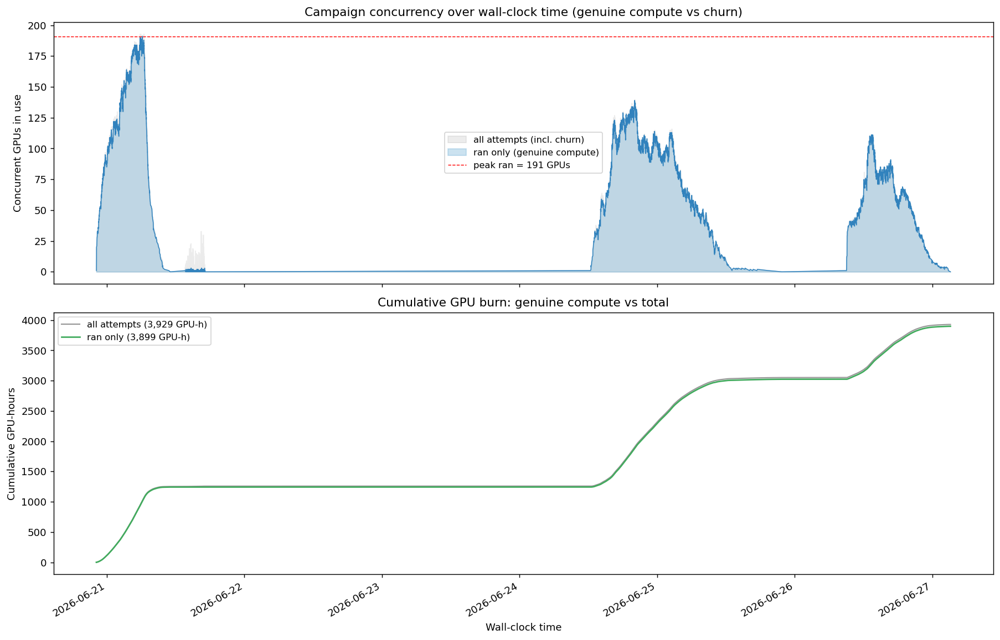

# Structure-based drug discovery for the OpenADMET Predicting PXR Induction Blind Challenge
Anthony Gitter  
Archived at https://doi.org/10.5281/zenodo.21084637

## Introduction
The [OpenADMET Predicting PXR Induction Blind Challenge](https://huggingface.co/spaces/openadmet/pxr-challenge) provided a rich dataset that reflects multiple stages of hit discovery and lead optimization: a primary screen, dose-response screen, counter-screen, and dose-response screen on an analog expansion set.
The goal was to use any of that data to predict pEC50 (-log of EC50) for the 513 compound analog expansion set that served as the test set.
My strategy was formed based on a few goals, assumptions and constraints.
I started late on June 12, just two and a half weeks before the deadline.
This was after phase 1 ended, so I did not have opportunities for feedback on the live leaderboard, but I did have the unblinded analog set 1 data to use.
Because the target compounds were intentionally structurally similar to the 63 active compounds, I was skeptical of how well supervised learning approaches could model the precise quantitative structure activity relationships.
Finally, I was eager to use the challenge to try something different that is outside my research group's typical workflow.
I did this with [TabPFN](https://github.com/agitter/asap-polaris-admet-challenge/blob/main/writeup.md) on the [ASAP Discovery x OpenADMET Challenge](https://doi.org/10.1021/acs.jcim.5c02106) and [AI scientists](https://github.com/agitter/openadmet-expansionrx-challenge/blob/main/writeup.md) on the [OpenADMET + ExpansionRx Blind Challenge](https://huggingface.co/spaces/openadmet/OpenADMET-ExpansionRx-Challenge).

That combination of factors motivated me to select [OpenFE](https://docs.openfree.energy/en/stable/index.html) relative binding free energy (RBFE) simulation as my core methodology.
[Alyssa Travitz](https://alyssatravitz.com/) from the [OpenFE team](https://openfree.energy/team/) recently gave a seminar here at the University of Wisconsin-Madison that hooked me.
To preview my results, the rest of this report could be characterized as what my clinical biostatistics colleagues call a [_futility analysis_](https://pubmed.ncbi.nlm.nih.gov/17128426/).
It became clear pre-submission that my approach had failed.
However, the process was educational.
I confirmed OpenFE is a great match for the computing infrastructure I have available, and I could see myself returning to RBFE analysis again (in closer consultation with collaborators who have expertise in molecular simulation).

## Methods
The initial steps involved preparing for the OpenFE RBFE calculations.
I assessed the 66 PXR PDB structures that the [OpenADMET team](https://openadmet.ghost.io/pregnane-x-receptor-pdb-structure-rerefinement/) [refined](https://github.com/OpenADMET/pxr_xtal_re-refinement), of which 62 for were available and had `.pdb` files.
I prepared these for docking.
I clustered the 513 test compounds using ECFP4 fingerprints and Tanimoto similarity and then associated each test compound with its most similar anchor compound in the training set.
Then, I docked all test compounds and the 89 training anchors with [GNINA](https://github.com/gnina/gnina), scanning over all PXR structures to find the structure with the most favorable score.
I used the docking results to select a structure for each compound and a starting pose for RBFE.
This also produced the GNINA scores, which were used later in the submitted ensemble model.
I checked the correlation of the GNINA CNNaffinity, minimizedAffinity, and CNNscore scores with the training anchor and phase 1 test compounds' pEC50.

I started the OpenFE stage on June 17 by creating a perturbation network within each compound cluster with a minimum spanning tree.
This produced the ligand transformation edges and simulations required.
I was concerned about the short amount of time left before the challenge end date and how I would be left empty-handed if I could not finish all the OpenFE runs in time.
This strongly influenced the OpenFE planning settings, such as using only 1 protocol repeat.
I ran a OpenFE pilot to assess GPU runtime and compatibility with the diverse GPU hardware I had access to, which spanned multiple CUDA capabilities.
Then, I launched the full scale RBFE run across these GPUs.
Many RBFE calculations finished in this initial batch of jobs, but some did not succeed and checkpointing partially completed work was implemented incorrectly.
I reran the failed jobs and analyzed the initial RBFE output.
Many transformations executed to completion with OpenFE but produced NaN results.
I switched from a KartografAtomMapper to a LOMAP mapper to see if different settings could recover some of the failed transformations.
The new mapper did not help.
I proceeded to collect the OpenFE results and propagate known pEC50 values along the connected parts of the RBFE network, using both training anchor compounds' pEC50 values.
I evaluated these estimated pEC50 values for the phase 1 test compounds.

Given the docking scores and partial RBFE-based pEC50 values, I considered multiple ways to ensemble the scores: docking-only, RBFE-only, a linear blend, an error-based threshold, or a weight estimated from RBFE reliability features (`path_ddg_error`, `min_overlap_on_path`, `max_edge_error_on_path`, `n_hops`, and `std_CNNscore_across_receptors`).
I also derived a linear calibration for the docking scores and RBFE scores.
Both the ensembles and calibration were assessed with 5-fold cross validation with bootstrapping on the phase 1 test compounds.
Some phase 1 test compounds did not have RBFE-based pEC50 values, so the training fold mean to impute missing data.
Despite the docking-only predictions having the best Relative Absolute Error (RAE) by a small margin, I opted for a linear blend of docking and RBFE.
This was motivated by the desire to evaluate whether RBFE could contribute to this analysis versus docking-only, which is similar to a expected baseline algorithm, and the small RAE difference.
I performed an additional round of hyperparameter optimization to choose the docking versus RBFE contribution in the linear ensemble and applied that model to the phase 2 test compounds.

Finally, I analyzed how the OpenFE computing workload was distributed across different GPUs.

Most code was written or drafted by Claude (Sonnet 4.6, Opus 4.6, or Opus 4.8), as well as some of the direct analysis.
Claude's [methods outline](claude/methods_outline.md) contains more information about some of these steps.
I also used GPT-5.5 Instant to prepare and test the OpenFE Singularity image and scripts.
High throughput computing was run at the University of Wisconsin-Madison Center for High Throughput Computing, which connects to the Open Science Pool.

## Results
There was a non-uniform selection of PXR structures across the docked compounds, with the most frequent selected structures listed below:
```commandline
1skx    11
8r81     9
8r82     8
5a86     7
7axf     7
7axc     6
7rio     6
8svq     6
5x0r     5
4ny9     4
8svo     4
6tfi     4
2qnv     3
6xp9     3
7axa     2
```
The correlation between the docking scores and the pEC50 values for the 89 training anchor and 253 phase 1 test compounds was modest.
CNNaffinity was the most-correlated docking score.


The 124 compound clusters produced 1,066 OpenFE transformation jobs.
Ultimately, 819 succeeded and 247 failed.
The failures were composed of `SimulationNaNError` (188), `IndexError` (54), and `OpenMMException` (5) errors.
Mapping the successes and failures back onto the RBFE perturbation network yielded 316 successful transformations and 217 incomplete edges.
This corresponded to 152 of 253 phase 1 test set compounds and 140 of 260 phase 2 test set compounds that could potentially have RBFE-derived pEC50s.
However, some of the results were flagged as having implausible results due to the high magnitude ddG values or the scale of the derived pEC50 values.
```commandline
|ddG| > 3: 128 edges (40.5%)
|ddG| > 4: 83 edges (26.3%)
|ddG| > 5: 48 edges (15.2%)
|ddG| > 7: 24 edges (7.6%)
|ddG| > 10: 5 edges (1.6%)
```
Further exploration highlighted large MBAR error values and other signs of poor convergence.

Cross-validation indciated that docking had a slightly better RAE than ensembles or RBFE alone on the phase 1 test set compounds:
```commandline
         model  rae_boot_mean  rae_boot_std  rae_point  spearman      mae
  docking_only       0.970214      0.029864   0.966267  0.284705 0.771722
   fixed_blend       0.974331      0.029283   0.970320  0.270836 0.774959
  sigmoid_gate       0.974673      0.028766   0.970762  0.267090 0.775312
threshold_gate       0.978728      0.029564   0.974688  0.269599 0.778447
     rbfe_only       1.011804      0.027238   1.008266  0.046388 0.805265
```




However, from another perspective, the performance was objectively bad in all cases.
The OpenFE diagnostics had already raised major concerns about how well the results had converged under the settings used, and these phase 1 test set results confirmed that the RBFE scores were uninformative.

Nevertheless, I was uninterested in submitting pure GNINA scores, so I selected a linear scaling factor to combine the calibrated docking and RBFE scores.
The elbow method suggested an even weighting of w=0.5.


The calibrated scores further indicated the futility of the RBFE scores, with a low coefficient that essentially relied heavily on the mean pEC50.
```commandline
Loaded model: fixed_blend (w=0.5)
  dock_cal: 0.8051*CNNaffinity + -1.3741
  rbfe_cal: 0.0521*pred_pEC50_raw + 4.3843
```

The analysis of the submitted pEC50s was again troubling.
The values had an unrealistic narrow range in part because the RAE-based calibration pushed the uninformative computational scores toward the mean pEC50.


The most interesting result was in how the OpenFE GPU jobs were distributed across Center for High Throughput Computing and Open Science Pool resources.
This analysis required some subtlety because some of those jobs were evicted before completion and had to be restarted.
Others terminated quickly because of environment or misconfigured checkpointing errors.
Overall, the project used 3,928.8 GPU hours.
The majority of the runtime came from opportunistic usage on idle GPUs that I do not own and are not allocated for shared use in the Center for High Throughput Computing.


There was variability in the mean runtime per job by GPU device and CUDA capability.
However, this could be attributed to job complexity or missed job failures more than a relationship between computing resources and runtime:
```commandline
                           device    n   mean_h  median_h    min_h     max_h
                      NVIDIA L40S 1088 0.690174  0.482083 0.086667 11.212222
                       NVIDIA L40  594 0.753148  0.620139 0.085000 11.551389
          NVIDIA GeForce RTX 3060    7 0.769246  0.781111 0.195000  1.069167
                      NVIDIA H200  310 0.823513  0.632083 0.090556  3.954167
            NVIDIA H100 80GB HBM3  403 0.884209  0.729444 0.087500  3.493056
                 NVIDIA RTX A5000  325 0.975892  0.825556 0.084444  4.471944
                       NVIDIA A40  204 0.976091  0.802639 0.133333  4.101111
            NVIDIA A100-SXM4-80GB  206 0.997783  0.622083 0.145000  5.665833
NVIDIA A100-SXM4-80GB MIG 3g.40gb   50 1.001339  0.643889 0.267500  6.680833
                  NVIDIA H100 NVL    8 1.022014  0.605972 0.553333  3.088889
             Tesla V100-PCIE-16GB   40 1.034590  0.802500 0.666944  3.985000
            NVIDIA A100-SXM4-40GB  307 1.046492  0.818056 0.086667 11.527500
       NVIDIA GeForce RTX 2080 Ti  445 1.067859  0.911389 0.084167  4.653056
            NVIDIA A100 80GB PCIe   53 1.184696  0.918611 0.130833  3.826111
             Tesla P100-PCIE-16GB   67 1.206820  1.010556 0.086389  5.478056
                  Quadro RTX 6000  100 1.280739  1.192222 0.085000  3.791111
       NVIDIA GeForce GTX 1080 Ti  131 1.394502  0.960833 0.112222 21.280556
             Tesla V100-PCIE-32GB    4 2.192847  2.371389 0.261389  3.767222
```

```commandline
 capability    n   mean_h  median_h
        6.0   67 1.206820  1.010556
        6.1  131 1.394502  0.960833
        7.0   44 1.139886  0.805139
        7.5  545 1.106919  0.935000
        8.0  616 1.038429  0.747083
        8.6  536 0.973269  0.818611
        8.9 1682 0.712413  0.557222
        9.0  721 0.859642  0.696389
```

Over a week, I completed all the OpenFE jobs with three major batches of submissions that reached a peak of 191 concurrent jobs.


## Discussion
- Summarize the auto-generated limitations document

Any academic or non-profit researcher who is interested in the Open Science Pool should reach out to me or [contact](https://osg-htc.org/contact.html) their staff.

## Acknowledgements
This project used the computing resources of the University of Wisconsin-Madison [Center for High Throughput Computing](https://chtc.cs.wisc.edu/uw-research-computing/cite-chtc) (doi:10.21231/GNT1-HW21) and the [Open Science Pool](https://osg-htc.org/acknowledging) (doi:10.21231/906P-4D78), which is supported by the National Science Foundation awards #2030508 and #2323298.
